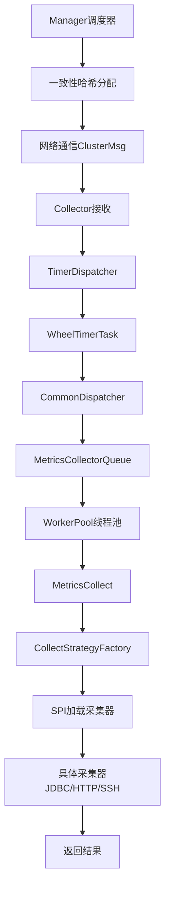
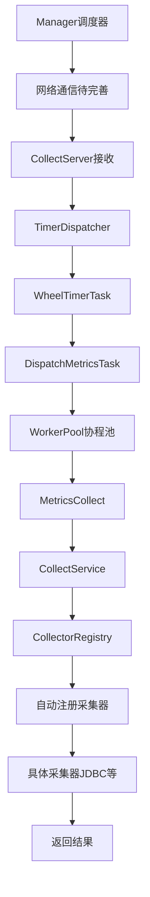

# HertzBeat Go vs Java 架构对比速览

## 🔄 调度流程对比

### Java版本调度流程


### Go版本调度流程


## 📊 核心差异对比表

| 维度 | Java版本 | Go版本 | 备注 |
|------|----------|---------|------|
| **网络通信** | ✅ 完整的ClusterMsg协议 | ⚠️ 待完善(目前模拟) | Go版本待开发 |
| **任务调度** | TimerDispatcher + CommonDispatcher | TimerDispatcher直接分发 | Go版本更简洁 |
| **工作池** | ThreadPoolExecutor | Goroutine Pool | Go版本更轻量 |
| **任务队列** | 优先级队列MetricsCollectorQueue | 直接Channel队列 | Java版本更复杂 |
| **采集器注册** | Java SPI自动发现 | init()函数+注册中心 | 各有优势 |
| **并发模型** | 线程池(~2MB/线程) | 协程池(~2KB/协程) | Go版本更高效 |
| **内存占用** | 较大(JVM开销) | 较小(原生编译) | Go版本优势明显 |
| **启动速度** | 较慢(JVM+类加载) | 很快(静态编译) | Go版本优势明显 |
| **超时处理** | 独立ScheduledExecutor | 集成在TimerDispatcher | Go版本更统一 |
| **重试机制** | 基于优先级队列 | 指数退避策略 | 实现方式不同 |

## 🎯 关键技术对比

### 1. 并发处理

#### Java版本
```java
// 线程池配置
ThreadPoolExecutor workerExecutor = new ThreadPoolExecutor(
    coreSize,           // 核心线程数
    maxSize,            // 最大线程数  
    10, TimeUnit.SECONDS, // 空闲超时
    new SynchronousQueue<>(), // 同步队列
    threadFactory,      // 线程工厂
    new ThreadPoolExecutor.AbortPolicy() // 拒绝策略
);
```

#### Go版本
```go
// 协程池配置
type WorkerPool struct {
    config     WorkerPoolConfig
    taskQueue  chan Task        // 任务通道
    workers    sync.Map         // 工作协程映射
    ctx        context.Context  // 上下文控制
}

// 动态协程管理
func (wp *WorkerPool) adjustWorkerCount() {
    if queuedTasks > currentWorkers*2 {
        wp.addWorker(false) // 添加非核心worker
    }
}
```

### 2. 采集器注册

#### Java版本 (SPI机制)
```java
// META-INF/services/org.apache.hertzbeat.collector.collect.AbstractCollect
org.apache.hertzbeat.collector.collect.database.JdbcCommonCollect
org.apache.hertzbeat.collector.collect.http.HttpCollectImpl

// 自动加载
ServiceLoader<AbstractCollect> loader = ServiceLoader.load(AbstractCollect.class);
for (AbstractCollect collect : loader) {
    COLLECT_STRATEGY.put(collect.supportProtocol(), collect);
}
```

#### Go版本 (注册中心机制)
```go
// 自动注册
func init() {
    registry.RegisterCollectorFactory(
        "jdbc",
        func(logger logger.Logger) basic.AbstractCollector {
            return NewJDBCCollector(logger)
        },
        registry.WithPriority(10),
    )
}

// 统一注册
func RegisterBuiltinCollectors(service *CollectService, logger logger.Logger) {
    collectors, _ := registry.GetGlobalCenter().CreateCollectors(logger)
    for protocol, collector := range collectors {
        service.RegisterCollector(protocol, collector)
    }
}
```

### 3. 任务分发策略

#### Java版本 (多层分发)
```java
// 1. TimerDispatcher调度
wheelTimer.newTimeout(timerJob, interval, TimeUnit.SECONDS);

// 2. CommonDispatcher分发
MetricsCollect metricsCollect = jobRequestQueue.getJob();
workerPool.executeJob(metricsCollect);

// 3. WorkerPool执行
workerExecutor.execute(runnable);
```

#### Go版本 (直接分发)
```go
// 1. TimerDispatcher调度
timeout := td.wheelTimer.NewTimeout(timerTask, delay)

// 2. 直接分发到WorkerPool
for _, metric := range job.Metrics {
    metricsCollect := worker.NewMetricsCollect(...)
    td.workerPool.Submit(metricsCollect)
}
```

## 🚀 性能特性对比

### 启动性能
| 指标 | Java版本 | Go版本 | 对比 |
|------|----------|--------|------|
| 启动时间 | ~3-5秒 | ~0.1-0.5秒 | Go快10倍 |
| 内存占用 | ~128MB+ | ~20-50MB | Go省60%+ |
| 文件大小 | ~50MB+ | ~10-20MB | Go小50%+ |

### 运行时性能
| 指标 | Java版本 | Go版本 | 对比 |
|------|----------|--------|------|
| 协程/线程开销 | 2MB/线程 | 2KB/协程 | Go省99.9% |
| 上下文切换 | 重量级 | 轻量级 | Go更快 |
| GC延迟 | 可能较长 | 通常<1ms | Go更稳定 |

## 🔧 开发体验对比

### 添加新采集器复杂度

#### Java版本
1. ✅ 实现AbstractCollect接口
2. ✅ 在META-INF/services中注册 
3. ✅ 自动发现，无需修改代码

**总结**: 配置简单，但依赖SPI机制

#### Go版本  
1. ✅ 实现AbstractCollector接口
2. ✅ 添加init()注册函数
3. ✅ 在registry.go中添加import

**总结**: 需要手动导入，但更灵活可控

### 调试和监控

#### Java版本
```java
// JVM工具链丰富
- JProfiler、VisualVM等性能分析
- JMX监控指标
- 成熟的APM工具支持
```

#### Go版本
```go
// Go原生工具
- go tool pprof性能分析  
- runtime.ReadMemStats()监控
- Prometheus metrics集成
```

## 🎯 选择建议

### 适合Java版本的场景
- ✅ 企业级环境，成熟度要求高
- ✅ 需要丰富的第三方库支持
- ✅ 团队Java技能更强
- ✅ CPU密集型采集任务

### 适合Go版本的场景  
- ✅ 云原生环境，资源敏感
- ✅ 高并发IO密集型采集
- ✅ 快速启动和部署需求
- ✅ 容器化微服务架构

## 📈 发展趋势

### Java版本优势保持
- 生态系统成熟
- 企业级特性完善
- 社区支持强大

### Go版本发展方向
- 网络通信层完善
- 更多协议采集器
- 云原生特性增强
- 性能优势扩大

---

## 📋 快速参考

### 核心类对应关系
| Java类 | Go对应 | 功能 |
|--------|--------|------|
| `TimerDispatcher` | `TimerDispatcher` | 时间轮调度 |
| `CommonDispatcher` | `DispatchMetricsTask` | 任务分发 |
| `WorkerPool` | `WorkerPool` | 工作池 |
| `MetricsCollect` | `MetricsCollect` | 采集任务 |
| `CollectStrategyFactory` | `CollectService` | 采集器管理 |
| `AbstractCollect` | `AbstractCollector` | 采集器接口 |

### 关键配置参数
| 配置项 | Java默认值 | Go默认值 | 说明 |
|--------|------------|----------|------|
| 核心工作线程 | CPU核数 | CPU核数 | 基础并发数 |
| 最大工作线程 | CPU核数×16 | CPU核数×4 | 最大并发数 |
| 任务队列大小 | SynchronousQueue | 1000 | 队列容量 |
| 时间轮大小 | 512 | 512 | 调度精度 |

这个对比文档帮助开发者快速理解两个版本的差异，选择合适的版本进行开发和部署。
